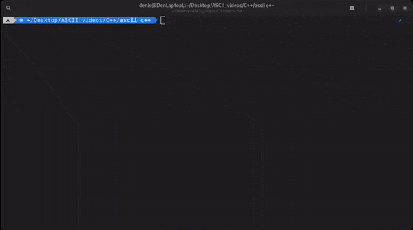

# Video to ASCII
A lightweight app to convert videos into ASCII videos and play it in terminal.


---
## Features
- FPS control (1-60)
- Frames caching
- Full video caching
- Auto video converting for terminal size
- Linux support
## Building
1. Clone the repository on local machine.
``git clone https://github.com/KiringD/ASCII_Video``
2. Go to cloned directory
``cd ASCII_Video``
3. Use cmake to create makefile
``cmake .``
4. Compile application.
``make``
### Requirements
- C++ 17 compiler (g++, clang)
- OpenCV
## Usage
```./ascii_video [video_path] [fps] [arguments]```
> **Note**
> If the video is too long or the fps is too high, the result may be laggy, and the program may consume a decent amount of RAM
### Arguments
- **--help** - base support information
- **--create-cache** - create a cache to start playing fast with current settings (terminal size, fps, video_file_name). If settings changed, you will have to create a new cache.
- **--save-frames** - save frames of video file with current fps. Frames preparation will be skipped in future, if video and fps didn't change.
- **--dont-use-cache** - all frames will be rendered regardless of whether the cache is created or not.
  **--recreate-frames** - recreates frames and save it.
---
## TODO
- [ ] Add Windows support
- [ ] RAM usage optimization
- [ ] GUI
